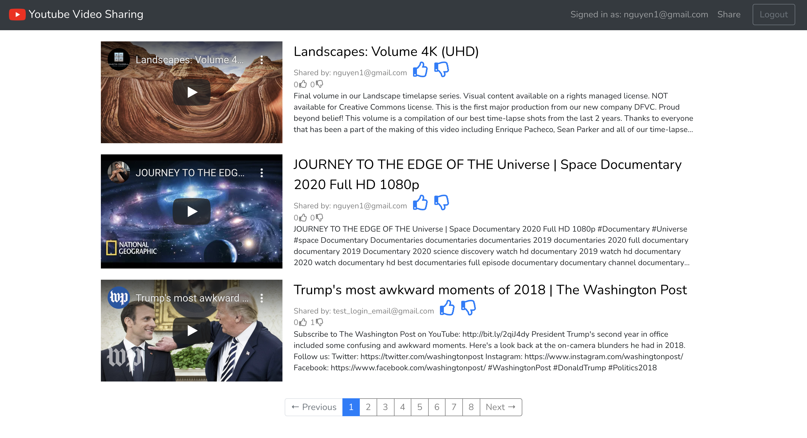
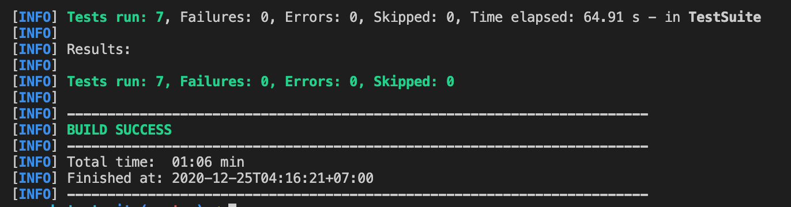

# remitano-welcome-app



<table>
<tr>
<td>
  Remitano welcome project about a web application that allows users to share Youtube videos.
</td>
</tr>
</table>

## Demo
Here is a working live demo :  [DEMO](https://theweatherforecast.today/)


## Usage
```
git clone
npm i
vim .env
```
Put in your `.env` file

```
NODE_ENV=development
PORT=3001
MONGO_URI=
JWT_SECRET=
CLIENT_DOMAIN=http://localhost:3000
```
Beside, you will need an `youtube-credentials.json` defining Youtube API credentials for retriving video's snippet.

```
// youtube-credentials.json
{
    "installed": {
        "client_id": ...,
        "project_id": ...,
        "auth_uri": "https://accounts.google.com/o/oauth2/auth",
        "token_uri": "https://oauth2.googleapis.com/token",
        "auth_provider_x509_cert_url": "https://www.googleapis.com/oauth2/v1/certs",
        "client_secret": ...,
        "redirect_uris": [
            "http://localhost"
        ],
        "javascript_origins": [
            "http://localhost"
        ]
    }
}
```


## Built with 

### 1. Client-side
- [ReactJS](https://reactjs.org/)
- [create-react-app](https://github.com/facebook/create-react-app)
- [React Bootstrap](https://react-bootstrap.github.io/)
- [react-router-dom](https://reactrouter.com/web/guides/quick-start)
- [Fontawesome](https://fontawesome.com/how-to-use/on-the-web/using-with/react)
- [Animate.css](https://animate.style/)

### 2. Server-side
- [Express.js](https://expressjs.com/)
- [NodeJS](https://nodejs.org/en/)
- [MongoDB](https://www.mongodb.com/2)

### 3. Unit test & Intergration test
- [Sinon.JS](https://sinonjs.org/)
- [Chai](https://www.chaijs.com/)
- [Mocha](https://mochajs.org/)
- [Maven](https://maven.apache.org/)

## Testcase:

* logInTest
* logOutTest
* signUpTest
* shareVideoTest
* voteUpVideoTest
* voteDownVideoTest
* unVoteVideoTest



## RESTful API sample

`GET /api/v1/movies/?offset=0&limit=10`<br>
`POST /api/v1/movies/`<br>
`PUT /api/v1/movies/<id>`<br>
`DELETE /api/v1/movies/<id>`

## License

MIT

